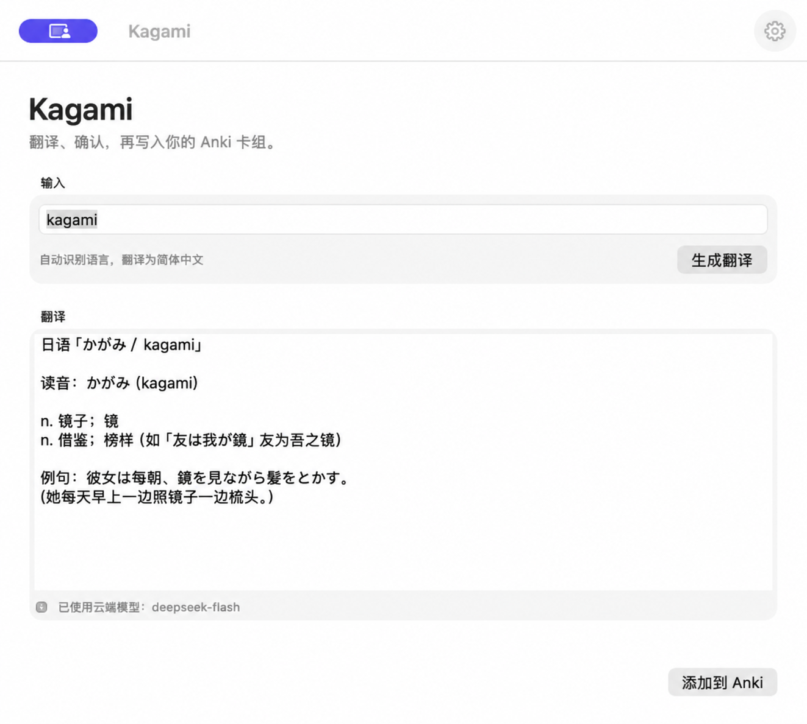
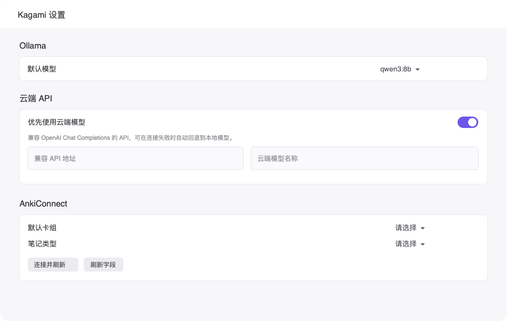

# Kagami

<p align="center">
  
</p>

> 用 AI 翻译单词或短语，确认后快速制成 Anki 卡片。

Kagami 的初衷很简单：把查词、整理释义、填写卡片和同步 Anki 这几步连成一条顺畅的流程，让制卡更轻松，把时间留给记忆本身。



## 能做什么

- **AI 翻译**：自动识别输入语言，按所选语言生成释义；结果可直接手动修改。
- **多语言界面**：支持简体中文、繁体中文、英语、日语、西班牙语、法语和俄语，切换立即生效。
- **本地或云端模型**：支持本地 [Ollama](https://ollama.com/) 模型，也支持 OpenAI Chat Completions 兼容的远程 API。
- **自动回退**：使用云端模型时，网络或请求失败可自动改用本地 Ollama。
- **按模板制卡**：读取 Anki 的卡组、笔记类型和字段名，按你的模板生成卡片内容与例句。
- **确认后同步**：预览并编辑各字段，确认后即可写入指定 Anki 卡组。



## 快速开始

### 下载并安装

1. 从 [Releases](https://github.com/Azdmjiny/kagami/releases/latest) 下载最新版 `Kagami-v*.dmg`。
2. 双击打开 DMG，将 `Kagami.app` 拖入「应用程序」文件夹后启动。

> 目前仅提供 Apple Silicon（M 系列芯片）Mac 版本，需要 macOS 14 或更高版本。Kagami 尚未经过 Apple 开发者签名；首次打开时如遇系统提示，可在 Finder 中按住 Control 点按 App，再选择「打开」。

**准备工作**

1. 安装并打开 [Anki](https://apps.ankiweb.net/)，并安装 [AnkiConnect](https://ankiweb.net/shared/info/2055492159) 插件。
2. 选择一种模型来源：
   - 本地：安装并启动 Ollama，下载一个模型（推荐 `qwen3:8b`）。
   - 云端：准备一个 OpenAI Chat Completions 兼容 API 的地址、模型名和密钥（实测本地小模型效果不太好，最好还是用聪明的的模型，翻译也用不了多少token）。

**使用步骤**

1. 打开 Kagami，在「设置」中读取本地模型，或填写云端 API 信息，并点击「保存 API 密钥」。
2. 点击「连接并刷新」，选择默认 Anki 卡组和笔记类型，再刷新字段。
3. 在主界面输入单词或短语，点击「生成翻译」。
4. 检查或修改翻译，点击「添加到 Anki」。
5. 预览卡片字段，确认后写入 Anki。

## 从源码构建

```bash
./script/build_and_run.sh
```

Kagami 会将云端 API 密钥保存在 macOS 钥匙串中；Anki 数据始终由本机的 AnkiConnect 写入。

尚未配置更新签名的构建不会启动自动更新，请从 Releases 下载新版手动安装。开发构建使用临时签名，重新构建后 macOS 可能要求再次授权钥匙串访问。
